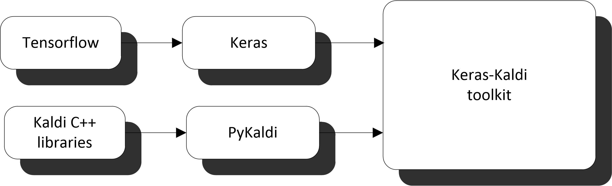
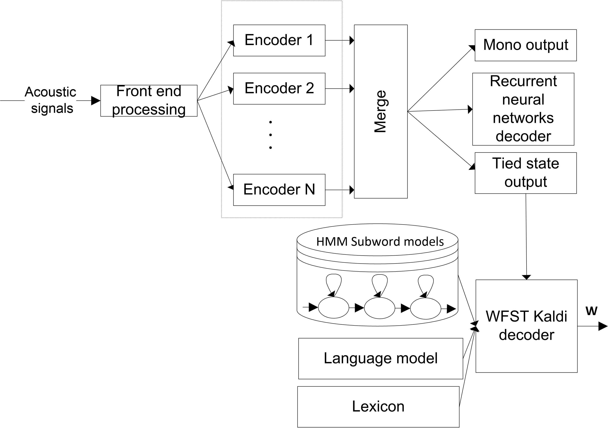

# Keras-Kaldi toolkit

The goal of this tool is to  train flexible deep neural acoustic models in the context of the hybrid DNN/HMM paradigm. The toolkit is based on the scalable Tensorflow machine learning backend and the Keras library. The model can be defined in a model definition file and the toolkit generates the required actual model and trains it using Keras and Tensorflow. Our experimental results on the 100 hours Librispeech  task show that the toolkit is competitive to the state-of-the-art systems.

 A high level overview for the Keras--Kaldi toolkit developed in this [work](http://github.com/yhifny/keras-kaldi) is shown in in the following figure:

 <p align="center">
 
</p>


 The toolkit has a Python interface   to Kaldi C++ libraries via  [PyKaldi](https://pykaldi.github.io). Moreover, Tensorflow and Keras toolkits are used for flexible neural network modeling.

 Our main acoustic  classifier developed in the Keras--Kaldi toolkit is based on the flexible  architecture  shown in the Figure:  

 The Kaldi toolkit is used to extract the acoustic features from the  audio signal (e.g.  fMLLR). Hence, the acoustic encoders are used to obtain hidden representations and improve the discrimination between the speech classes. The toolkit supports running N acoustic encoders in parallel. An encoder consists of a sequence of neural layers.  The toolkit has three output layers. The output of the mono frame level targets  is implemented via a dense layer with a softmax activation. These targets are not used for decoding and only used for regularization. An Recurrent neural networks decoder with attention layer  is used for regularization and it predicts the mono phone sequence targets. This output layer is similar to the multitask learning method introduced in this [paper](https://arxiv.org/abs/1609.06773). The final output is the tied state frame level targets. It is implemented via a dense layer with a softmax activation.


# Installation

  - Install [miniconda](https://docs.conda.io/en/latest/miniconda.html).
  - Create an environment.
  - Install PyKaldi using conda inside the environment.
  - Install Tensorflow  using conda inside the environment (gpu version).
  - Install Keras using conda inside the environment.
```
conda create --name tf_gpu python=3.6
conda activate tf_gpu
conda install -c pykaldi pykaldi
conda install tensorflow-gpu=1.13
conda install pyyaml
conda install keras
```

  - Install Kaldi toolkit (http://jrmeyer.github.io/asr/2016/01/26/Installing-Kaldi.html).

Please note the toolkit was tested with tensorflow  version 1.13 and I am trying to test it on version 2.1.

# 100 hours Librispeech  task
  - Run Kaldi Librispeech setup until step 14.
  - Assume the cloned code is in ~/keras-kaldi/librispeech_work
  - Generate fmllr features:
```
cd ~/keras-kaldi/librispeech_work   
ln -s ./01_gen_mllr_feat.sh /media/lumi/alpha/kaldi/egs/librispeech/s5/01_gen_mllr_feat.sh
cd  /media/lumi/alpha/kaldi/egs/librispeech/s5/
./01_gen_mllr_feat.sh
```
  - Sort fmllr features based on their length. It is used to minimize the padding:
```
cd ~/keras-kaldi/librispeech_work   
./02_sort_fmllr_feat.sh (update the paths in the script)
```
  - Generate the alignments for train/dev:
```
cd ~/keras-kaldi/librispeech_work   
ln -s 03_gen_align.sh /media/lumi/alpha/kaldi/egs/librispeech/s5/03_gen_align.sh
cd  /media/lumi/alpha/kaldi/egs/librispeech/s5/
./03_gen_align.sh
cd ~/keras-kaldi/librispeech_work   
./04_collect_align.sh
```
  - Generate the phone targets for RNN decoder regularization:
```
cd ~/keras-kaldi/librispeech_work   
./05_collect_target_sequence.sh
```
  - Get model info:
```
cd ~/keras-kaldi/librispeech_work   
./06_compute_num_classes.sh
```
  - Update the  paths in config_kaldi.py before
  - Compute the global mean and variance:
```
cd ~/keras-kaldi/librispeech_work   
python 07_compute_mean_var_stats.py
```
  - Compute state prior probability:
```
  08_compute_priors.sh
```
  - Train a model selected from the yaml files in the config_train dir:
```
 09_train.sh
```
  - Decode and compute the WER:
```
 10_decodel_test_set.sh
```

# Acknowledgments
  - https://github.com/mravanelli/pytorch-kaldi
  - https://github.com/val260/DeepSpeech-Keras
  - https://github.com/dspavankumar/keras-kaldi
  - Some layers  are collected from the web.
  - QCRI where I ran some experimental work.
  - Dan Povey.

# Future work
  - ivector support.
  - Mixed precision.
  - Sequence training/LF-MMI objective functions support.
  - knowledge distillation.

# Contributing
   - Let us talk about this work!   
